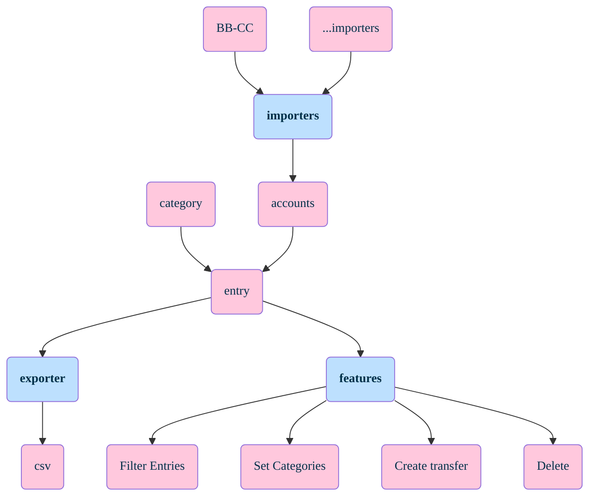

## Mapa de funcionalidades

## My to-do list

- Objective: end-to-end Classification to Conta.BB / Cartao.SICOOB
- Audit and complete BB entries for JAN, FEV and MAR

- Import improvements:
  - Avoid duplicate imports (decided to warn -> how to check? what is duplicated?)

- On category changes: change signal according category

- Parser improvements / technical debt:
  - #### OBS: The minimum is made, focus on persist NOW!
  - Parser UI is loading classes directly, must pass through api (discover how!!)

- Create other importers
  - C6 Credit Card (CSV parser) - Invert value signal (positive/negative)
  - Inter Credit Card (PDF parser?)
  - Generic CSV (for manual entries?)

## Decided not to-do (at least now!)
- Change the way transfer was record. 
  - Create "Tranfer"/model table: id_transfer, id_debt_entry, id_crt_entry
    Each transfer will have it own ID!
  Annotation: It is needed or I can made some kind of "check" at the end?

- Implement delete action (delete by database until there)